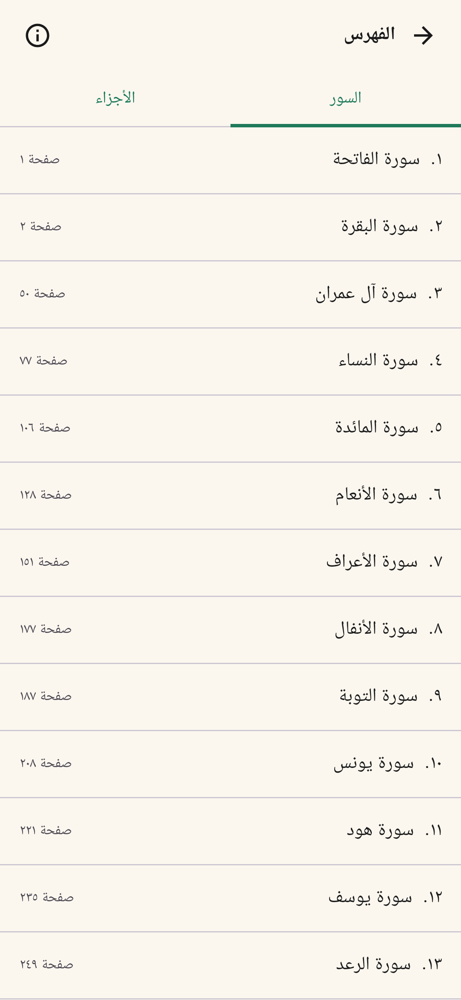
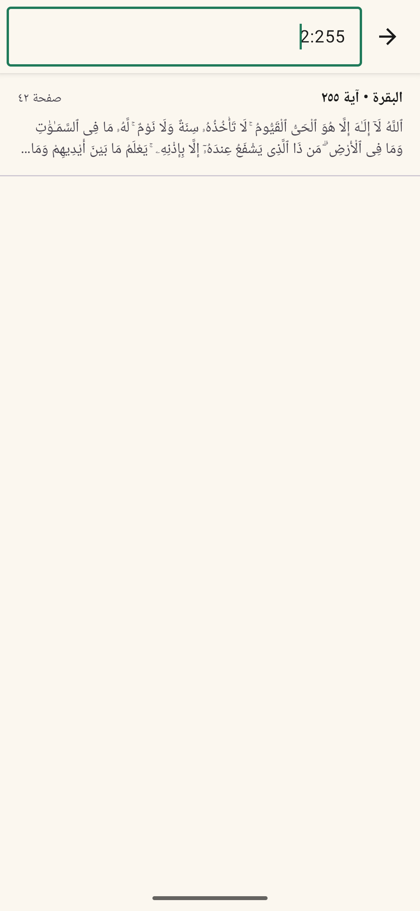
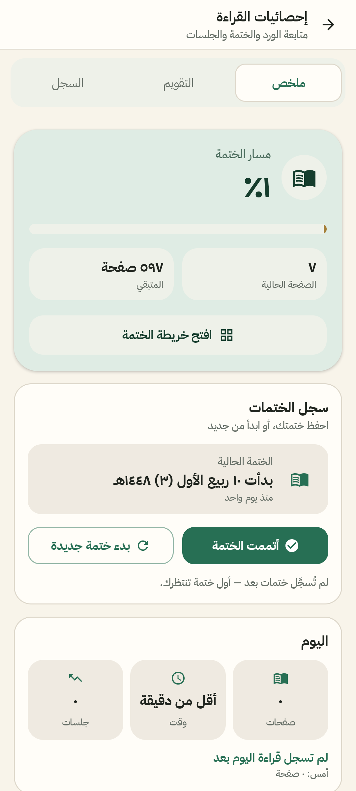

<div align="center" dir="rtl">


# قرآن القارئ

**مصحف أندرويد مفتوح المصدر، يعمل بالكامل دون إنترنت ومن غير إعلانات.**

[](https://github.com/zahmee/quran/actions/workflows/android.yml)
[](LICENSE)
[](mushaf_app)
[](mushaf_app/app/src/main/java)

[صفحة المشروع](https://zahmee.github.io/quran/) · [سياسة الخصوصية](https://zahmee.github.io/quran/privacy-policy.html) · [المساهمة](CONTRIBUTING.md)

</div>

## نظرة عامة

يعرض التطبيق صفحات المصحف الكاملة بطبقة إحداثيات تجعل كل آية قابلة للتحديد والتظليل.
ويجمع بين تجربة القراءة الهادئة والبحث السريع ومتابعة الورد والختمات، مع حفظ كل البيانات
محليًا على جهاز المستخدم.

## الصور

<div align="center">
  
  
  
  
</div>

> لقطات توضيحية؛ قد تختلف تفاصيل الواجهة مع الإصدارات الأحدث.

## المميزات

- **مصحف كامل:** جميع الصفحات الـ 604 بصور واضحة وتقليب من اليمين إلى اليسار.
- **تفاعل مع الآية:** تحديد الآية وتظليل أسطرها، مع النسخ والمشاركة.
- **بحث مرن:** بالنص أو اسم السورة من غير حساسية للتشكيل، أو بمفتاح مثل `2:255`.
- **تنقّل سريع:** فهرس السور والأجزاء والانتقال إلى أي صفحة.
- **علامتان مرجعيتان:** لحفظ موضعين مستقلين والعودة إليهما بسرعة.
- **متابعة الختمة:** خريطة الصفحات المقروءة، سجل الختمات، وتواريخ هجرية وميلادية.
- **إحصائيات محلية:** الوقت والصفحات والجلسات وسلسلة أيام القراءة.
- **قراءة مرنة:** تمرير أفقي أو عمودي، وضع ليلي، ملء الشاشة، وتخصيص أزرار الرأس.
- **خصوصية أولًا:** لا حسابات ولا إعلانات ولا تحليلات؛ التطبيق لا يطلب إذن الإنترنت.

## التقنيات

- Kotlin + Jetpack Compose + Material 3
- Room لإحصائيات القراءة، وDataStore للتفضيلات والعلامات
- Coil 3 لتحميل صور الصفحات من أصول التطبيق
- Android Gradle Plugin 8.12.3 · Kotlin 2.0.21 · `compileSdk/targetSdk 36` · `minSdk 24`

## البدء السريع

### المتطلبات

- JDK 17
- Android SDK 36
- Android Studio حديث، أو أدوات Android SDK من سطر الأوامر

### البناء

```bash
git clone https://github.com/zahmee/quran.git
cd quran/mushaf_app

# Linux / macOS
./gradlew :app:assembleDebug

# Windows
gradlew.bat :app:assembleDebug
```

ستجد حزمة التجربة في:
`mushaf_app/app/build/outputs/apk/debug/app-debug.apk`.

### الفحص المحلي

```bash
./gradlew :app:assembleDebug :app:lintDebug
```

ينفّذ GitHub Actions الأمر نفسه تلقائيًا عند كل Pull Request أو دفع إلى `main`.

## بناء إصدار موقّع

1. انسخ `mushaf_app/keystore.properties.sample` إلى `mushaf_app/keystore.properties`.
2. ضع ملف التوقيع وحدّث القيم. هذه الملفات مستبعدة من Git.
3. نفّذ `./gradlew :app:assembleRelease`.

من غير بيانات التوقيع يُبنى ملف Release غير موقّع. لا تضع مفاتيح التوقيع أو كلمات المرور في المستودع.

## بنية المستودع

```text
quran/
├─ .github/                         # CI وقوالب المساهمة
├─ docs/                            # موقع GitHub Pages وسياسة الخصوصية
├─ mushaf_app/                      # مشروع Android / Gradle
│  └─ app/src/main/
│     ├─ java/com/mushaf/reader/    # الواجهة والبيانات
│     └─ assets/                    # صفحات المصحف وإحداثيات الآيات
├─ publishing/                      # صور ونصوص المتجر
└─ build_ayah_regions.py            # توليد ayah_regions.json
```

## بيانات الآيات

لإعادة توليد طبقة مناطق الآيات:

```bash
python build_ayah_regions.py
```

يكتب السكربت الناتج إلى
`mushaf_app/app/src/main/assets/data/ayah_regions.json`. راجع
[`quran_pages_complete_table_schema.md`](quran_pages_complete_table_schema.md) لتفاصيل المخطط.

## المساهمة والأمان

نرحب بإصلاح الأخطاء وتحسين الواجهة والتوثيق. اقرأ [`CONTRIBUTING.md`](CONTRIBUTING.md) قبل فتح Pull Request،
وأبلغ عن الثغرات بشكل خاص وفق [`SECURITY.md`](SECURITY.md).

## الرخصة والمحتوى

شفرة المشروع والأصول الأصلية متاحة للجميع بموجب [رخصة MIT](LICENSE).

> **تنبيه المحتوى:** صور صفحات المصحف والنص القرآني وبيانات الإحداثيات ليست مملوكة بالضرورة للمشروع
> ولا يمنح MIT حق إعادة توزيعها. اقرأ [`NOTICE.md`](NOTICE.md) قبل إعادة نشر نسخة مع المحتوى المضمّن.

---

### English

Quran Al-Qari is an open-source, offline-first Android Mushaf reader built with Kotlin and Jetpack
Compose. It provides all 604 page images, interactive ayah highlighting, full-text search, two
bookmarks, reading statistics, khatma tracking, six reading themes, and horizontal or vertical paging.
The source code is MIT-licensed; bundled Mushaf imagery and Qur'anic datasets are subject to their
original rights. See [`NOTICE.md`](NOTICE.md).
