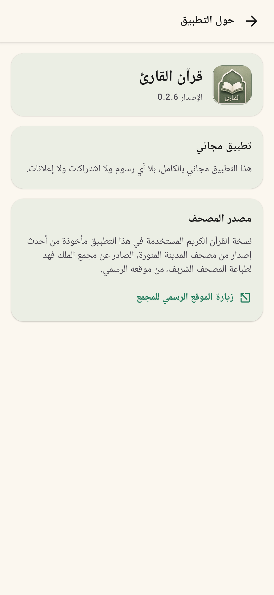
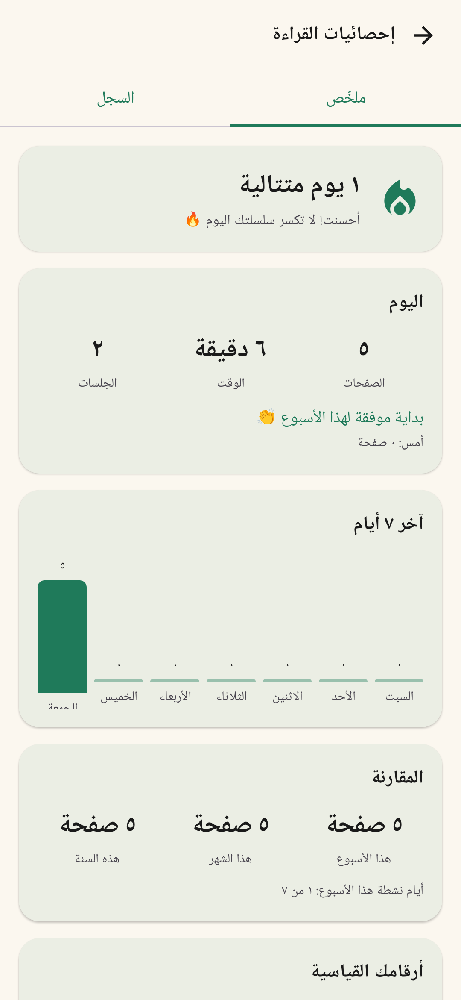

<div align="center" dir="rtl">


# قرآن القارئ

**مصحف أندرويد مفتوح المصدر، يعمل بالكامل دون إنترنت ومن غير إعلانات.**

[](https://play.google.com/store/apps/details?id=com.mushaf.reader)
[](https://github.com/zahmee/quran/releases/latest)
[](https://github.com/zahmee/quran/actions/workflows/android.yml)
[](LICENSE)
[](mushaf_app)
[](mushaf_app/app/src/main/java)

[التطبيق على المتجر](https://play.google.com/store/apps/details?id=com.mushaf.reader) · [صفحة المشروع](https://zahmee.github.io/quran/) · [سجل التغييرات](CHANGELOG.md) · [سياسة الخصوصية](https://zahmee.github.io/quran/privacy-policy.html) · [المساهمة](CONTRIBUTING.md)

</div>

## نظرة عامة

يعرض التطبيق صفحات المصحف الكاملة بطبقة إحداثيات تجعل كل آية قابلة للتحديد والتظليل.
ويجمع بين تجربة القراءة الهادئة والبحث السريع ومتابعة الورد والختمات، مع حفظ كل البيانات
محليًا على جهاز المستخدم.

## الصور

<div align="center">
  
  
  
  
</div>

> لقطات توضيحية؛ قد تختلف تفاصيل الواجهة مع الإصدارات الأحدث.

## المميزات

- **مصحف كامل:** جميع الصفحات الـ 604 بصور واضحة وتقليب من اليمين إلى اليسار.
- **تفاعل مع الآية:** تحديد الآية وتظليل أسطرها، مع النسخ والمشاركة.
- **تفسير مرافق:** «التفسير الميسر» و«الميسر في غريب القرآن الكريم» من مجمع الملك فهد، مضمّنان
  في التطبيق ويُقرآن دون إنترنت.
- **بحث مرن:** بالنص أو اسم السورة من غير حساسية للتشكيل، أو بمفتاح مثل `2:255`. يفهرس كل آية
  بالرسمين العثماني والإملائي، ويعرض «نتائج قريبة» حين تُكتب الكلمة بصيغة أخرى.
- **تنقّل سريع:** فهرس السور والأجزاء والانتقال إلى أي صفحة.
- **علامتان مرجعيتان:** لحفظ موضعين مستقلين والعودة إليهما بسرعة.
- **متابعة الختمة:** خريطة الصفحات المقروءة، سجل الختمات، وتواريخ هجرية وميلادية.
- **إحصائيات محلية:** الوقت والصفحات والجلسات وسلسلة أيام القراءة.
- **قراءة مرنة:** تمرير أفقي أو عمودي، ستة مظاهر للورق والحبر، ملء الشاشة، أشرطة تقدّم للسورة
  والجزء، وتخصيص أزرار الرأس ومواضعها.
- **يتكيّف مع الشاشة:** رأس مضغوط في الوضع الأفقي وعلى الشاشات العريضة والمطويات، وخيار لإبعاد
  الأزرار وأطراف الصفحة عن الزوايا الدائرية.
- **نسخ احتياطي واسترجاع:** ملف واحد يحمل موضع القراءة والعلامات والتقدّم والجلسات والختمات
  والإعدادات، تحفظه حيث تشاء وتستعيده على أي جهاز.
- **تحديث من داخل التطبيق:** يخبرك بصدور إصدار أحدث ويترك التنزيل لتطبيق المتجر — دون أن يطلب
  التطبيق إذن الإنترنت.
- **خصوصية أولًا:** لا حسابات ولا إعلانات ولا تحليلات؛ التطبيق لا يطلب إذن الإنترنت.

## التقنيات

- Kotlin + Jetpack Compose + Material 3
- Room لإحصائيات القراءة، وDataStore للتفضيلات والعلامات
- Coil 3 لتحميل صور الصفحات من أصول التطبيق
- Play App Update للتحديث داخل التطبيق (عبر تطبيق المتجر، بلا اتصال شبكي من التطبيق نفسه)
- Android Gradle Plugin 8.12.3 · Kotlin 2.0.21 · `compileSdk/targetSdk 36` · `minSdk 24`

## البدء السريع

### المتطلبات

- JDK 17 أو أحدث
- Android SDK 36
- Android Studio حديث، أو أدوات Android SDK من سطر الأوامر

### البناء

```bash
git clone https://github.com/zahmee/quran.git
cd quran/mushaf_app

# Linux / macOS
./gradlew :app:assembleDebug

# Windows
gradlew.bat :app:assembleDebug
```

ستجد حزمة التجربة في:
`mushaf_app/app/build/outputs/apk/debug/app-debug.apk`.

### الفحص المحلي

```bash
./gradlew :app:assembleDebug :app:lintDebug :app:testDebugUnitTest
```

ينفّذ GitHub Actions الأمر نفسه تلقائيًا عند كل Pull Request أو دفع إلى `main`.

اختبارات الوحدة تعمل على JVM بلا جهاز ولا محاكٍ، لأن المنطق الخالص — تقسيم الأجزاء، وطيّ الحروف
العربية، وحساب الأيام، وصيغة النسخة الاحتياطية — مفصول عمدًا عن أنواع أندرويد.

## بناء إصدار موقّع

1. انسخ `mushaf_app/keystore.properties.sample` إلى `mushaf_app/keystore.properties`.
2. ضع ملف التوقيع وحدّث القيم. هذه الملفات مستبعدة من Git.
3. نفّذ `./gradlew :app:assembleRelease`.

من غير بيانات التوقيع يُبنى ملف Release غير موقّع. لا تضع مفاتيح التوقيع أو كلمات المرور في المستودع.

للنشر إلى Google Play من سطر الأوامر راجع [`publishing/PLAY-PUBLISHING-AR.md`](publishing/PLAY-PUBLISHING-AR.md).

## بنية المستودع

```text
quran/
├─ .github/                         # CI وقوالب المساهمة
├─ docs/                            # موقع GitHub Pages وسياسة الخصوصية والصور
├─ mushaf_app/                      # مشروع Android / Gradle
│  ├─ app/src/main/
│  │  ├─ java/com/mushaf/reader/    # الواجهة والبيانات
│  │  └─ assets/                    # صفحات المصحف وإحداثيات الآيات وقاعدة المحتوى
│  ├─ app/src/test/                 # اختبارات وحدة على JVM
│  └─ tools/                        # أدوات مساعدة (بناء قاعدة المحتوى، فحص اعتماد النشر)
├─ publishing/                      # صور ونصوص المتجر ودليل النشر
├─ CHANGELOG.md                     # سجل التغييرات لكل إصدار
└─ build_ayah_regions.py            # توليد ayah_regions.json
```

## بيانات الآيات

لإعادة توليد طبقة مناطق الآيات:

```bash
python build_ayah_regions.py
```

يكتب السكربت الناتج إلى
`mushaf_app/app/src/main/assets/data/ayah_regions.json`. راجع
[`quran_pages_complete_table_schema.md`](quran_pages_complete_table_schema.md) لتفاصيل المخطط.

## المساهمة والأمان

نرحب بإصلاح الأخطاء وتحسين الواجهة والتوثيق. اقرأ [`CONTRIBUTING.md`](CONTRIBUTING.md) قبل فتح Pull Request،
وأبلغ عن الثغرات بشكل خاص وفق [`SECURITY.md`](SECURITY.md).

## الرخصة والمحتوى

شفرة المشروع والأصول الأصلية متاحة للجميع بموجب [رخصة MIT](LICENSE).

> **تنبيه المحتوى:** صور صفحات المصحف والنص القرآني وبيانات الإحداثيات ونصوص التفسير ليست مملوكة
> بالضرورة للمشروع ولا يمنح MIT حق إعادة توزيعها. اقرأ [`NOTICE.md`](NOTICE.md) قبل إعادة نشر نسخة
> مع المحتوى المضمّن.

---

### English

Quran Al-Qari is an open-source, offline-first Android Mushaf reader built with Kotlin and Jetpack
Compose. It ships all 604 page images, interactive ayah highlighting, bundled tafsir, full-text
search over both the Uthmani and imlaei spellings, two bookmarks, reading statistics, khatma
tracking, six reading themes, horizontal or vertical paging, and single-file backup and restore.
It requests no internet permission at all. The source code is MIT-licensed; bundled Mushaf imagery
and Qur'anic datasets are subject to their original rights. See [`NOTICE.md`](NOTICE.md).
